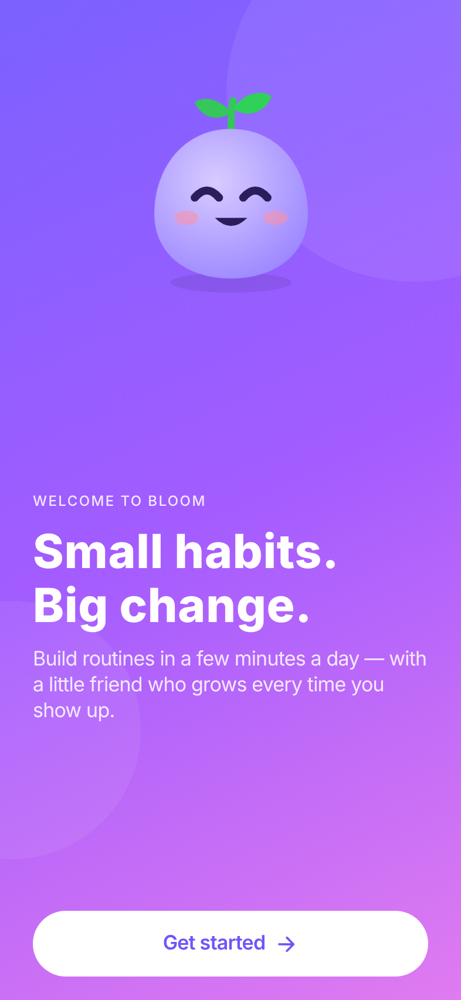
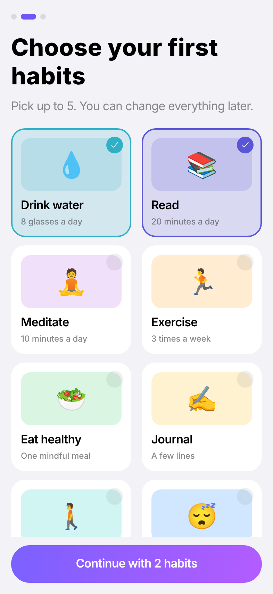
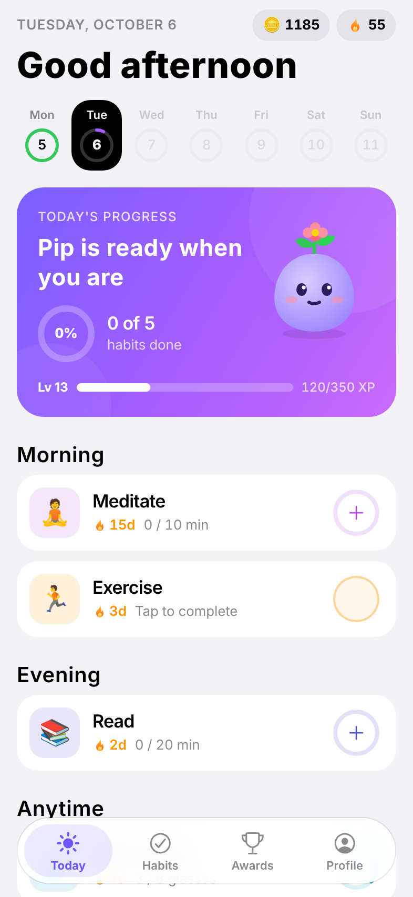
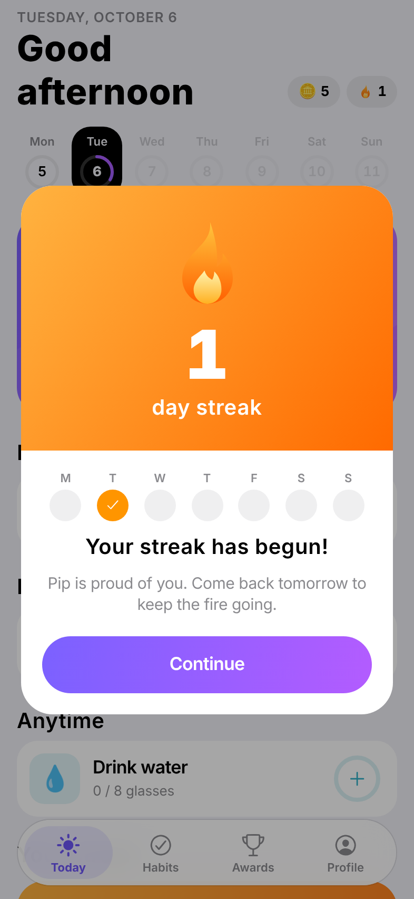
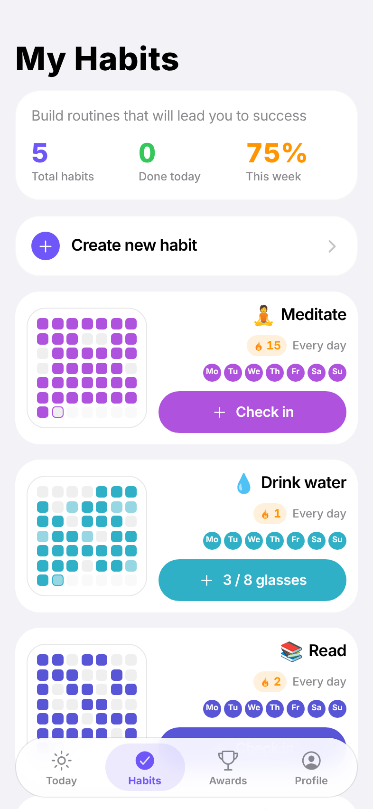
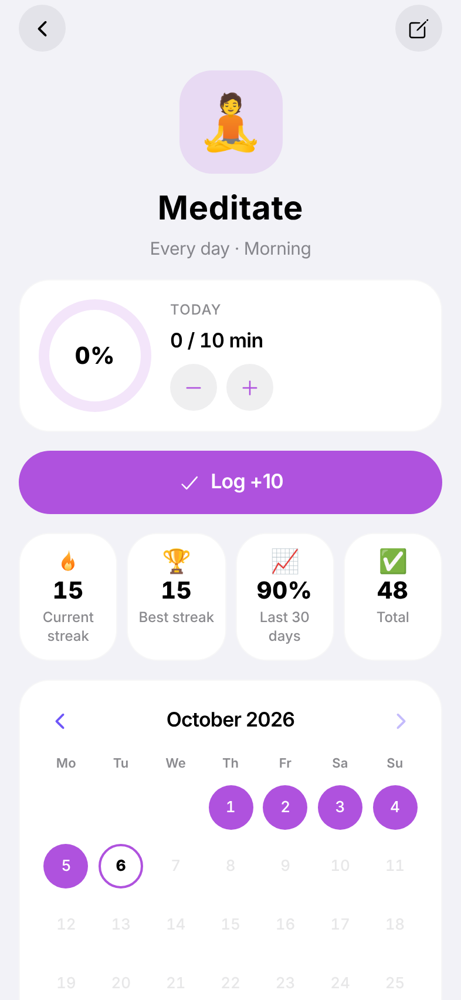
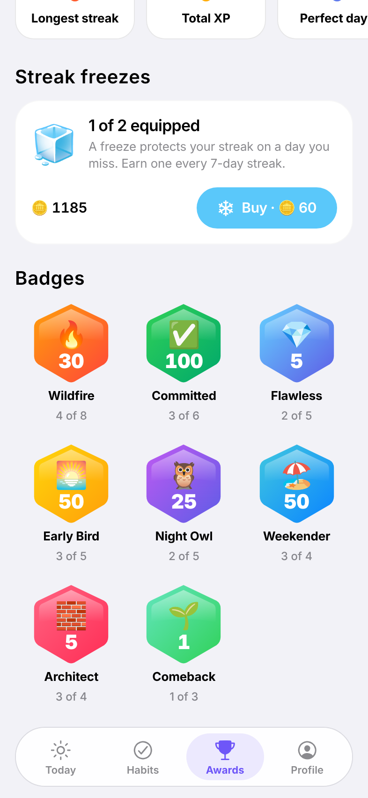
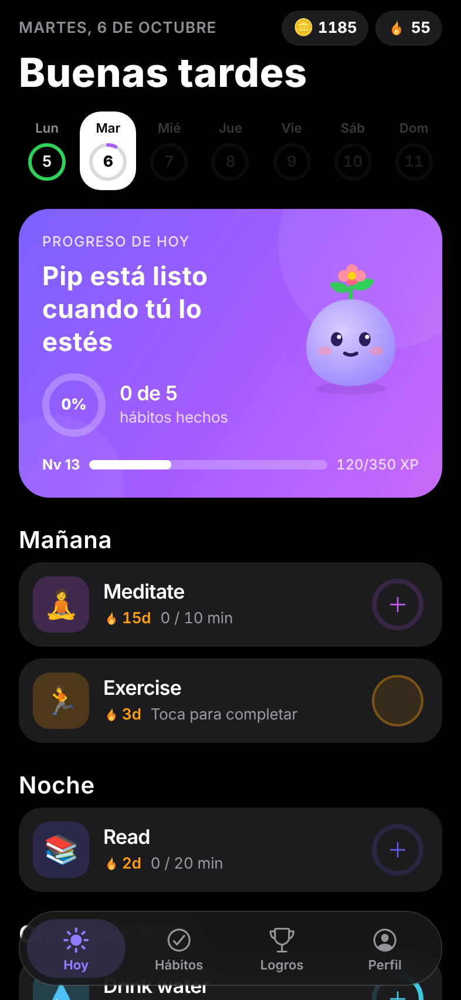

# Bloom — habit tracker

A local-first habit tracker for iOS and Android, built with Expo. You care for a small companion, keep a Duolingo-style streak, and the app never shames you when you miss a day.

| Welcome | Pick habits | Today | Streak |
| --- | --- | --- | --- |
|  |  |  |  |

| My Habits | Habit detail | Awards | Dark · Español |
| --- | --- | --- | --- |
|  |  |  |  |

## What works today

- **Onboarding:** pick starter habits, then name and hatch your companion, Pip.
- **Today:** a week strip with a completion ring for each day, a hero card (progress ring, Pip and a level bar), habits grouped by time of day, and **one-tap check-in**. Count and timer habits step up with each tap; long-press resets. Tap a past day in the strip to log it.
- **Four habit types:** yes/no, count, timer and quit. **Four schedules:** daily, chosen weekdays, X times a week and every N days. Each habit can have a local reminder.
- **Streaks:** a streak per habit (weekly for X-per-week habits) plus a Duolingo-style app streak. You earn a **streak freeze** for every 7 days and can buy more with coins. Freezes are spent automatically.
- **Comeback flow:** when a streak breaks, a warm card offers *Repair* (coins) or *Start fresh*. It never guilt-trips.
- **Celebrations:** a full-screen streak card with the week's checkmarks, a perfect-day bonus and a "streak saved by freeze" message.
- **Game loop:** you earn XP and coins. Levels grow Pip through 5 stages (egg, hatchling, sprout, bloom, guardian). There are 8 tiered badges and personal records.
- **My Habits:** cards with a 7-week heatmap. **Habit detail:** stats and a month calendar where you can tap any day to fix your history. You can archive, restore or delete a habit.
- **Profile:** light/dark/auto theme, EN/ES/auto language, week start day, haptics on/off, JSON export and reset.
- Fully offline, with data in on-device SQLite. Light and dark themes, English and Spanish, Reduce Motion support and screen-reader labels.

Design follows Apple's HIG: system colors, the Dynamic Type ramp and continuous corners. Motion follows [Emil Kowalski's skills](https://github.com/emilkowalski/skills): Reanimated CSS transitions on the UI thread, 0.97 press scale, no tab-switch animation, delight saved for rare moments, and one haptic per action. See `docs/DECISIONS.md`.

## Run it

```bash
cd apps/mobile
npm install
npx expo start            # press "a" for Android, "i" for iOS
```

Reanimated 4 needs the New Architecture, so use a **development build** for the real feel. Expo Go is fine for a quick look.

```bash
npx expo run:android      # or: npx eas-cli@latest build --profile development --platform android
npx expo run:ios
```

Checks (CI runs these too):

```bash
npm run typecheck && npm run lint && npm run format:check && npm run test:coverage
```

## Repo layout

```
apps/mobile      Expo app (see docs/ARCHITECTURE.md)
supabase         Postgres schema, RLS policies, pgTAP tests
docs             DECISIONS, ARCHITECTURE, ANALYTICS, screenshots
.github          CI: typecheck, lint, format, tests + coverage gate, web bundle, RLS tests
```

## Configuration

No keys are needed to run the app today. For the next phases, copy `apps/mobile/.env.example` and fill in the Supabase, PostHog, Sentry and RevenueCat public keys. Server secrets go in EAS or Supabase secrets.

## Roadmap status

- **Phase 0 (foundation):** done, apart from wiring the analytics, crash-reporting and backend SDKs, which need your keys.
- **Phase 1 (core tracker):** mostly done. Accounts and sync are next.
- **Phase 2 (companion):** the core loop is done. Adventures, the cosmetic shop and widgets are still to build.
- **Phases 3–5** have not started.
