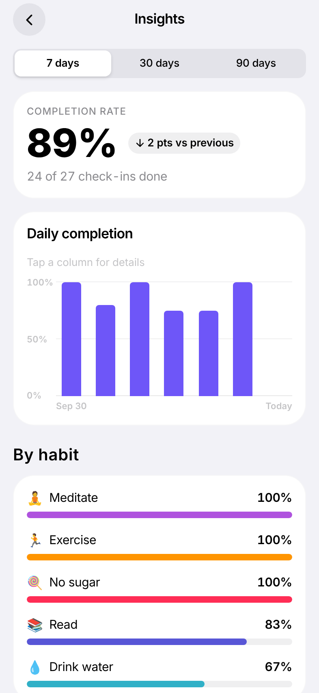
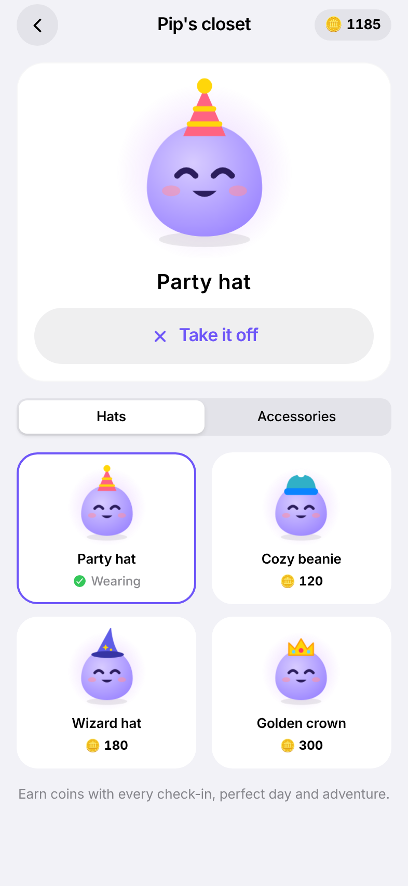
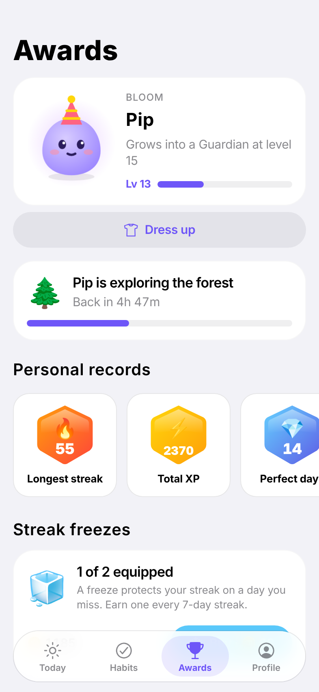
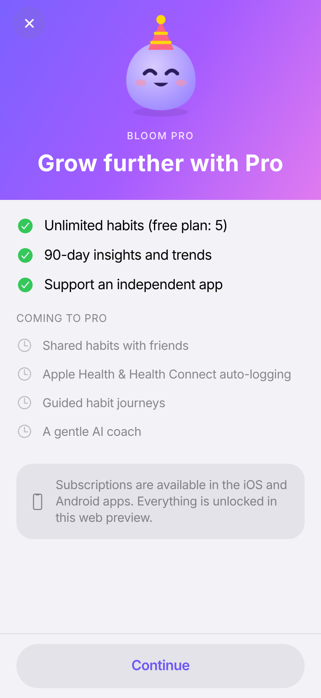

# Bloom — habit tracker

A local-first habit tracker for iOS and Android, built with Expo. You care for a small companion, keep a Duolingo-style streak, and the app never shames you when you miss a day.

| Welcome | Pick habits | Today | Streak |
| --- | --- | --- | --- |
|  |  |  |  |

| My Habits | Habit detail | Awards | Dark · Español |
| --- | --- | --- | --- |
|  |  |  |  |

| Insights | Pip's closet | Adventures | Pro |
| --- | --- | --- | --- |
|  |  |  |  |

## What works today

- **Onboarding:** pick starter habits, then name and hatch your companion, Pip.
- **Today:** a week strip with a completion ring for each day, a hero card (progress ring, Pip and a level bar), habits grouped by time of day, and **one-tap check-in**. Count and timer habits step up with each tap; long-press resets. Tap a past day in the strip to log it.
- **Four habit types:** yes/no, count, timer and quit. **Four schedules:** daily, chosen weekdays, X times a week and every N days. Each habit can have a local reminder.
- **Streaks:** a streak per habit (weekly for X-per-week habits) plus a Duolingo-style app streak. You earn a **streak freeze** for every 7 days and can buy more with coins. Freezes are spent automatically.
- **Comeback flow:** when a streak breaks, a warm card offers *Repair* (coins) or *Start fresh*. It never guilt-trips.
- **Celebrations:** a full-screen streak card with the week's checkmarks, a perfect-day bonus and a "streak saved by freeze" message.
- **Game loop:** you earn XP and coins. Levels grow Pip through 5 stages (egg, hatchling, sprout, bloom, guardian). There are 8 tiered badges and personal records.
- **My Habits:** cards with a 7-week heatmap. **Habit detail:** stats and a month calendar where you can tap any day to fix your history. You can archive, restore or delete a habit.
- **Insights:** completion rate with change vs the previous period, a daily (or weekly) column chart with tap-for-details, per-habit and per-weekday breakdowns. 7/30 days free, 90 days Pro.
- **Adventures:** once today's streak is secured, send Pip on an 8-hour adventure. It survives app restarts, sends a "Pip is back" notification, and pays out coins.
- **Pip's closet:** spend coins on hats and accessories drawn onto Pip at every growth stage.
- **Accounts + cloud sync** (Supabase): sign in with an emailed 6-digit code; habits, logs and freezes sync across devices (last write wins, deletes propagate, works offline). In-app account deletion.
- **Bloom Pro** (RevenueCat): an honest, dismissible paywall with annual pre-selected, trial terms next to the button, and restore. The free plan gets 5 habits; gates switch on only where purchases are possible.
- **Telemetry:** PostHog events and Sentry crash reporting, enabled when their keys are set.
- **Profile:** account and sync, Pro, closet, insights, light/dark/auto theme, EN/ES/auto language, week start day, haptics on/off, JSON export and reset.
- Fully offline, with data in on-device SQLite. Light and dark themes, English and Spanish, Reduce Motion support and screen-reader labels.

Design follows Apple's HIG: system colors, the Dynamic Type ramp and continuous corners. Motion follows [Emil Kowalski's skills](https://github.com/emilkowalski/skills): Reanimated CSS transitions on the UI thread, 0.97 press scale, no tab-switch animation, delight saved for rare moments, and one haptic per action. See `docs/DECISIONS.md`.

## Run it

```bash
cd apps/mobile
npm install
npx expo start            # press "a" for Android, "i" for iOS
```

Reanimated 4 needs the New Architecture, so use a **development build** for the real feel. Expo Go is fine for a quick look.

```bash
npx expo run:android      # or: npx eas-cli@latest build --profile development --platform android
npx expo run:ios
```

Checks (CI runs these too):

```bash
npm run typecheck && npm run lint && npm run format:check && npm run test:coverage
```

## Repo layout

```
apps/mobile      Expo app (see docs/ARCHITECTURE.md)
supabase         Postgres schema, RLS policies, pgTAP tests
docs             DECISIONS, ARCHITECTURE, ANALYTICS, screenshots
.github          CI: typecheck, lint, format, tests + coverage gate, web bundle, RLS tests
```

## Configuration

No keys are needed: without them the app is local-only and nothing is gated. To turn features on, copy `apps/mobile/.env.example` to `.env.local` and fill in:

| Feature | What to set |
| --- | --- |
| Accounts + sync | `EXPO_PUBLIC_SUPABASE_URL`, `EXPO_PUBLIC_SUPABASE_PUBLISHABLE_KEY`. Then run `supabase db push` and `supabase functions deploy delete-account revenuecat-webhook`, and enable the Email OTP provider. |
| Subscriptions | `EXPO_PUBLIC_REVENUECAT_IOS_KEY` / `_ANDROID_KEY`, a `pro` entitlement, and an offering with annual + monthly packages. Point the RevenueCat webhook at the `revenuecat-webhook` function with the `REVENUECAT_WEBHOOK_SECRET` Supabase secret. |
| Analytics | `EXPO_PUBLIC_POSTHOG_KEY` (+ host) |
| Crashes | `EXPO_PUBLIC_SENTRY_DSN` |

Server secrets (service role key, webhook secret) live only in Supabase or EAS secrets.

## Web preview on Vercel

`apps/mobile/vercel.json` builds the static web export (`npx expo export --platform web` → `dist`) with an SPA rewrite. Set the Vercel project's root directory to `apps/mobile`. The web build is a preview: subscriptions, reminders and haptics are mobile-only, so everything is unlocked there.

## Roadmap status

- **Phase 0 (foundation):** done. SDKs activate with your keys.
- **Phase 1 (core tracker):** done, including accounts, sync and insights.
- **Phase 2 (companion):** done apart from home-screen widgets, which need native targets (see `docs/DECISIONS.md`).
- **Phase 3 (paywall):** built and wired to RevenueCat. It needs your RevenueCat products and sandbox testing on devices.
- **Phases 4–5** (Health, social, journeys, AI coach, store launch) have not started.
